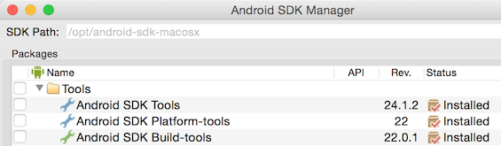
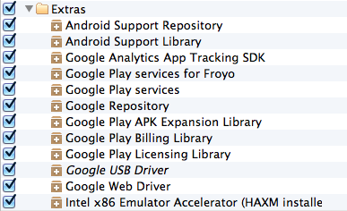

# Getting started

## Setting up your workshop development environment
This workshop is aimed at the intermediate Java or OO programmer who wants to start with native Android development. As a prerequisite, please set up a working Android development environment. Please check if you have already installed&mdash;and if not, download and install&mdash;the following software on your computer:

### 1. Java

A [Java Software Development Kit (JDK)](http://www.oracle.com/technetwork/java/javase/downloads/index.html), version 7 is recommended. A Java Runtime Environment (JRE) is not enough to do Android development, you need the Java SDK!

**Note:** On a Mac you need a Java Runtime Environment (JRE) version 6 to be able to run Android Studio.

### 2. Android Studio
Install the [Android Studio](http://developer.android.com/sdk/installing/studio.html) bundle, which includes: 
  * The Android Studio IDE, which is based on the community edition of IntelliJ IDEA. 
  * All the Android SDK tools to design, test, debug, and profile your app. 
  * The latest Android platform to compile your app. 
  * The latest Android system image to run your app in the emulator.

### 3. Git client (optional)

A [Git](http://git-scm.com/downloads) client or command line tool is recommended to clone the workshop repository. [Sourcetree](http://www.sourcetreeapp.com/) is a pretty cool Git GUI client. If you don't have an internet connection, or don't want the hassle of working with Git, you can get (or download) a zip-file with the repository contents on the day of the workshop.

### 4. Ensure everything's up-to-date

After you have installed Android Studio you might need to update to the latest version. Fire up Android Studio and select “Check for Updates…” under the “Help” menu. We will use a modern version of Android Studio for this workshop.

Also check that you have the latest “SDK Tools”, “Android platform” and “Extras” installed. You can access the SDK manager by clicking on the SDK Manager Icon  in the toolbar. Your configuration should look something like the screenshots below, but using whichever latest versions are available.

> You only need the latest versions of the “Tools”, “Platform-tools” and “Build-tools”

> Select the packages that are selected in the screenshot. If you don't have an Android device install one of the Intel Atom images so you can create an emulator later on. If you have enough hard disk space simply click the checkbox before the “Android 6.0 (API 23)” folder to select and download everything.

> Simply install everything in the “Extras” section for the workshop. The “Google USB Driver” is only compatible with Windows machines, so install that if you run Android Studio on Windows and want to connect your dev phone via a USB cable.

Specifically, you should have:
* Under “Tools:
 * Android SDK Tools
 * Android SDK Platform-tools
 * Android SDK Build=tools
* Under a modern Android version (as of this writing, “Android 6.0 (API 23)”):
 * SDK Platform
 * Documentation for Android SDK (recommended)
 * Samples for SDK (recommended for learning)
* Under “Extras”:
 * Android Support Repository
 * Android Support Library
 * Google Play services
 * Google Repository

Once you have selected all the packages above click the “Install Packages” button and sit tight.

### 5. Prepare a device

Preferably we would like you to connect your phone to your computer and run and test the samples on a real device. If you don't own an Android device you can install an Android emulator, also known as an Android Virtual Device (AVD).

#### Physical device

Plug in your device through USB, and make sure it's set up for USB debugging and permits installing apps from unknown sources.

**Note:** If you're connecting your Android device to a Windows machine, make sure you have installed the correct device driver. If you have ever successfully connected your Android device to your PC, for instance to exchange files, you probably already have it.

##### USB Debugging

If you want to run apps on your device the first thing you need to do is enable “USB debugging” on the device itself (by starting the Settings app on your device and selecting “Developer Options” → USB Debugging”). If you don't see the developer options item in your settings menu and you are running Android 4.0 (Ice Cream Sandwich) or higher you can enable them by clicking on the “Settings” → “About Phone” → “Build” item a couple of times to enable them. If you run an older Android version the USB Debugging checkbox might reside in the Applications section of your settings. 

##### Unknown Sources

You must also allow installation of apps from sources other than the Play Store by checking Unknown Sources in the security settings (on most phones). Now it's simply a matter of plugging in your phone and running the Android application by clicking the run button in Android Studio.

#### ADB permission

Now that you've When you plug in your device

#### Virtual device (Emulator)

Install at least one Android Virtual Device (AVD) running Lollipop for this workshop. All the capabilities of the AVD Manager are accessible directly from the Android Studio interface. Click the AVD Manager Icon  in the toolbar to open it and create new AVDs.

##Let's go!

Once you've installed all the software, necessary development kits and set up a device, you are all set for the workshop!

You may want to keep this [cheatsheet](cheatsheet.md) at hand. Now let's [go to lesson 1](lesson1)!
