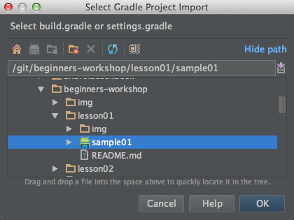
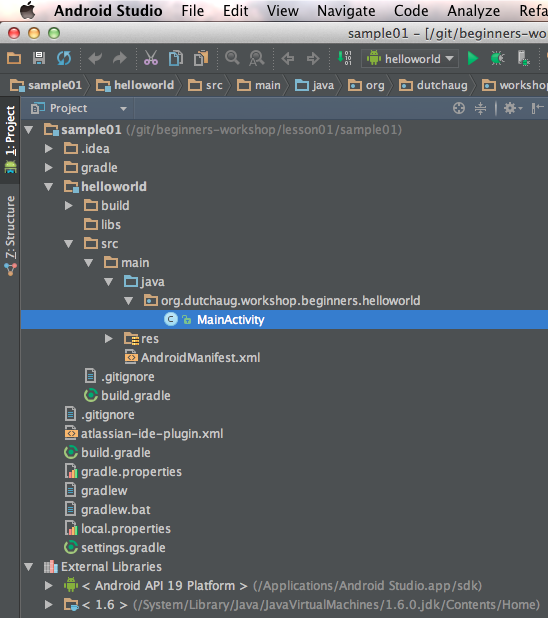
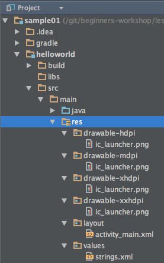

# Lesson 01 - Exploring your Android development environment

## What you'll learn in this lesson
* Importing an Android project in Android Studio
* Understand and navigate the basic Android project structure in Android Studio
  * Learn about the AndroidManifest.xml file
  * Know where the java source files are located
  * Understand the basics of resources
* Know the basics about and how to start the Android Tools from Android Studio
  * The Android SDK Manager 
  * The Android Virtual Device (AVD) Manager
  * The Device Debug Monitoring System (DDMS)
  
If you know all about the learning goals for this lesson move on to [lesson 2](../lesson02)

## Android Studio

### Importing an Android project in Android Studio
Android Studio contains a new project wizard which is started by chosing **File > New Project...**. However convenient it also poses a lot of questions, settings and steps which might be a bit too much at this point. For this workshop we would like to teach you how to import an existing Android project so we can keep the project contents consise to what is needed in the sample or exercise. In this lesson we are going to import a very tiny "Hello World" app.


> The File Menu


>The Quick Start Menu

In Android Studio, chose **File > Import Project...** or select the **Import Project...** option from the quick start menu and select the `sample01` folder. 


>Select Gradle Project import. Android Studio may ask you to choose the type of project you are importing. If this is the case, make sure to choose **Import project from external model** and select the **Gradle** option.

If all's well Android Studio will start to build your project right away.

### The Android Project structure
If you have imported the `sample01` project correctly you will end up with a project structure like this



#### Gradle build files
At the root of the project folder you can see various gradle files. You can use command line tools, Ant, Maven and Gradle to build and package your Android projects. The Android Tools team have chosen [Gradle](http://www.gradle.org/) as the main build system. You can read more about the new build system [here](http://tools.android.com/tech-docs/new-build-system). 

The `build.gradle`, `gradle.properties` and `settings.gradle` files describe how to build the helloworld project.

* The `settings.gradle` file describes which sub-projects to include. This is only the `helloworld` project folder in our case
* The `build.gradle` file in the root folder describes the necessary dependencies for the build itself and a common setup for all projects
* The `helloworld/build.gradle` describes how to build our Android project. It applies an android plugin and describes the configuration.

The `gradlew` and `gradlew.bat` scripts (for unix resp. Windows environments) are gradle _wrapper_ scripts. You can run a build on the command line using this script. It requires a certain Gradle version and if it is not present it downloads the binaries on the fly. The `gradlew` scripts and `gradle` directory are added automatically when you create a project with the Android Studio New Project Wizard and 

```
sample01> ./gradlew assembleDebug
:helloworld:compileDebugNdk UP-TO-DATE
:helloworld:preBuild
:helloworld:preDebugBuild
:helloworld:checkDebugManifest
:helloworld:prepareDebugDependencies
:helloworld:compileDebugAidl UP-TO-DATE
:helloworld:compileDebugRenderscript UP-TO-DATE
:helloworld:generateDebugBuildConfig UP-TO-DATE
:helloworld:mergeDebugAssets UP-TO-DATE
:helloworld:generateDebugResValues UP-TO-DATE
:helloworld:generateDebugResources UP-TO-DATE
:helloworld:mergeDebugResources UP-TO-DATE
:helloworld:processDebugManifest UP-TO-DATE
:helloworld:processDebugResources UP-TO-DATE
:helloworld:generateDebugSources UP-TO-DATE
:helloworld:compileDebugJava UP-TO-DATE
:helloworld:preDexDebug UP-TO-DATE
:helloworld:dexDebug UP-TO-DATE
:helloworld:processDebugJavaRes UP-TO-DATE
:helloworld:validateDebugSigning
:helloworld:packageDebug UP-TO-DATE
:helloworld:assembleDebug UP-TO-DATE

BUILD SUCCESSFUL

Total time: 5.702 secs
```

#### The project build.gradle file
```
apply plugin: 'android'

android {
    compileSdkVersion 19
    buildToolsVersion "19.0.2"

    defaultConfig {
        minSdkVersion 14
        targetSdkVersion 19
        versionCode 1
        versionName "1.0"
    }
}

dependencies {
    compile fileTree(dir: 'libs', include: ['*.jar', '*.aar'])
}
```
> The `helloworld/build.gradle` file

The `minSdkVersion` version states which Android OS level you minimally support with your app. We have chosen to support version 14 (Android 4.0 - Ice Cream Sandwich) and up in this workshop.

The `targetSdkVersion` informs the system that you have tested against the target version and the system should not enable any compatibility behaviors to maintain your app's forward-compatibility with the target version. The application is still able to run on older versions (down to `minSdkVersion`). To maintain your application along with each Android release, you should increase the value of this attribute to match the latest API level, then thoroughly test your application on the corresponding platform version.

The `versionCode` is a value which is used mainly for distribution on Google Play. Every update should have a higher version code than the previous package.

The `versionName` value is a user-friendly name for the app version and can be any string. This value is visible to the end-users on Google Play.

#### AndroidManifest.xml

#### Java source files

#### Resources

> The Android project resources

##### drawables

##### values
`strings.xml`

##### layouts
`activity_main.xml`

## Android Tools

### SDK Manager

### AVD Manager

### DDMS

