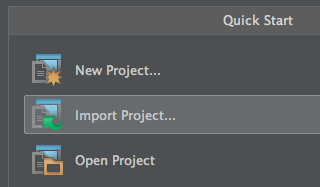
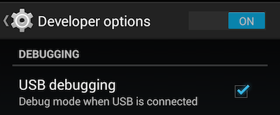
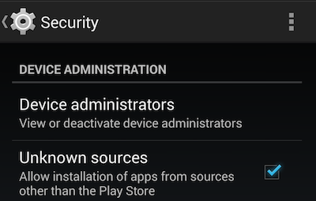
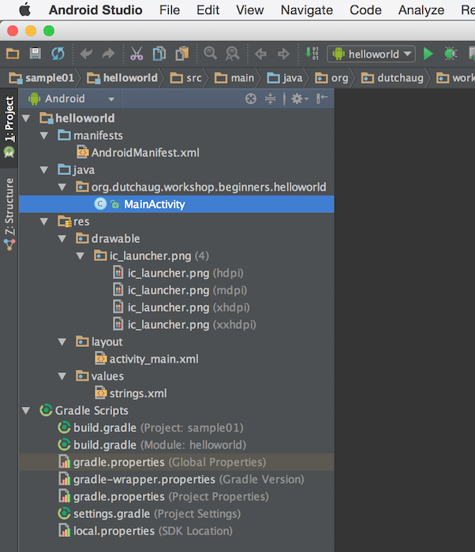
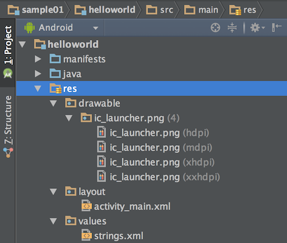

# _Lesson 1_<br/>Android Studio and Android projects

## Learning goals
* Importing an Android project in Android Studio
* Understand and navigate the basic Android project structure in Android Studio
  * Learn about the **AndroidManifest.xml** file
  * Know where the java source files are located
  * Understand the basics of resources
  * Learn about **shape drawables**
  
If you know all about the learning goals for this lesson move on to [lesson 2](../section2/README.md)

## Android Studio

### Importing an Android project in Android Studio
Android Studio contains a new project wizard, which is started by chosing “File” → “New Project…”. While convenient, it also asks you with a lot of questions, settings and steps which might be a bit too overwhelming at this point. For this workshop we'll only focus on ipmorting an existing Android project.

#### 1. Getting the lesson content

In this lesson we are going to import a very tiny “Hello World” app. Before we do this, please clone this “beginners-workshop” Github repository to your local machine by executing the following command:

    git clone git@github.com:pixplicity/beginners-workshop.git

Not familiar with Git? No problem, just grab the ZIP file straight from the project page:

> https://github.com/Pixplicity/beginners-workshop


> Download ZIP from GitHub

#### 2. Importing the project into Android Studio

In Android Studio, chose “File” → “Import Project…” 


> The File Menu

…or select the “Import Project…” option from the quick start menu 


> The Quick Start Menu

Then select the “lesson01” folder from the folder where you cloned the “beginners-workshop” Github repository.


> Android Studio _might_ ask you to choose the type of project you are importing. If this is the case, make sure to choose “Import project from external model” and select the **Gradle” option.

If all's well Android Studio will start to build your project right away.


> After your project is build you can take your project for a spin. Simply click the green run button in the toolbar, select “Run 'helloworld'” from the Run menu or by pressing `Ctrl-R` on a Mac or `Shift-F10` on Windows or Linux. If all's well you will be prompted to run the app on a device, or you can select an emulator. Check the “Use same device for future launches” checkbox to skip this dialog on the next run.


> If you want to run the lesson01” app on your device the first thing you need to do is enable “USB debugging” on the device itself (by starting the Settings application and selecting “Developer Options” → “USB Debugging”). If you don't see the developer options item in your settings menu and you are running Android 4.0 (Ice Cream Sandwich) or higher you can enable them by clicking on the “Settings” → “About Phone” → “Build number” item a couple of times to enable them. If you run an older Android version the “USB Debugging” checkbox might reside in the “Applications” section of your settings. 


> You must also allow installation of apps from sources other than the Play Store by checking “Unknown Sources” in the security settings (on most phones). Windows users should install the Android USB device driver. Now it’s simply a matter of plugging in your phone and running the Android application by clicking the run button in Android Studio.

### The Android Project structure
If you have imported the “lesson01” project successfully you will end up with a project structure like this



#### Gradle build files
Android apps are written in the Java programming language. The Android SDK tools compile your code—along with any data and resource files and packages it into an APK-file, an Android package file, which is a ZIP archive file with an `.apk` suffix. The APK file contains all the files which make up an Android app and is the file that Android-powered devices use to install your app on your user's Android device.

In the Gradle Scripts section you can see various gradle files. You can use [command line tools](http://developer.android.com/tools/building/building-cmdline.html), [Ant](http://ant.apache.org/), [Maven](http://maven.apache.org/) and [Gradle](http://www.gradle.org/) to build and package your Android projects into these APK files which you can install on your Android device directly or sign and upload to the [Google Play Store](https://play.google.com/apps/publish/). The Android Tools team have chosen the highly flexible [Gradle](http://www.gradle.org/) build system as the default Android build system. You can read more about the new build system [here](http://tools.android.com/tech-docs/new-build-system). 

The **build.gradle**, **gradle.properties** and **settings.gradle** files describe how to build the helloworld project.

* The [**settings.gradle**](lesson01/settings.gradle) file describes which sub-projects to include. This is only the **helloworld** project folder in our case, but you can imagine that with larger projects you end up isolating re-usable code in sub-projects.
* The [**build.gradle**](lesson01/build.gradle) file in the root folder describes the necessary dependencies for the build itself and a common setup for all projects
* The [**helloworld/build.gradle**](lesson01/helloworld/build.gradle) describes how to build the helloworld Android app. It applies an android plugin and describes the build configuration.

The `gradlew` and `gradlew.bat` scripts (for unix resp. Windows environments) are gradle _wrapper_ scripts. You can run a build on the command line using this script. It requires a certain Gradle version and if it is not present it downloads the binaries on the fly. The `gradlew` scripts and `gradle` directory are added automatically when you create a project with the Android Studio New Project Wizard.

```
lesson01> ./gradlew assembleDebug
:helloworld:compileDebugNdk UP-TO-DATE
:helloworld:preBuild
:helloworld:preDebugBuild
:helloworld:checkDebugManifest
:helloworld:prepareDebugDependencies
:helloworld:compileDebugAidl UP-TO-DATE
:helloworld:compileDebugRenderscript UP-TO-DATE
:helloworld:generateDebugBuildConfig UP-TO-DATE
:helloworld:mergeDebugAssets UP-TO-DATE
:helloworld:generateDebugResValues UP-TO-DATE
:helloworld:generateDebugResources UP-TO-DATE
:helloworld:mergeDebugResources UP-TO-DATE
:helloworld:processDebugManifest UP-TO-DATE
:helloworld:processDebugResources UP-TO-DATE
:helloworld:generateDebugSources UP-TO-DATE
:helloworld:compileDebugJava UP-TO-DATE
:helloworld:preDexDebug UP-TO-DATE
:helloworld:dexDebug UP-TO-DATE
:helloworld:processDebugJavaRes UP-TO-DATE
:helloworld:validateDebugSigning
:helloworld:packageDebug UP-TO-DATE
:helloworld:assembleDebug UP-TO-DATE

BUILD SUCCESSFUL

Total time: 5.702 secs
```

#### The project build.gradle file
The **build.gradle** file in the helloworld directory is very simple.

```
apply plugin: 'com.android.application'

android {
    compileSdkVersion 22
    buildToolsVersion "22.0.1"

    defaultConfig {
        minSdkVersion 14
        targetSdkVersion 22
        versionCode 1
        versionName "1.0"
    }
}

dependencies {
    compile fileTree(dir: 'libs', include: ['*.jar', '*.aar'])
}
```

The first line says to apply the Android application plugin for this build, whereafter (with the code block preceded by the word 'android') we immediately configure this plugin with the Android Domain Specific Language (DSL). [More info](http://tools.android.com/tech-docs/new-build-system/user-guide)

The **minSdkVersion** version states which Android OS level you minimally support with your app. We have chosen to support version 14 (Android 4.0 - Ice Cream Sandwich) and up in this workshop.

The **targetSdkVersion** informs the system that you have tested against the target version and the system should not enable any compatibility behaviors to maintain your app's forward-compatibility with the target version. The application is still able to run on older versions (down to **minSdkVersion**). To maintain your application along with each Android release, you should increase the value of this attribute to match the latest API level, then thoroughly test your application on the corresponding platform version.

The **versionCode** is a value which is used mainly for distribution on the [Google Play Store](https://play.google.com/store/apps). Every update should have a higher version code than the previous package. Don't worry about forgetting this. When you upload your app to the Play Store you will be notified if this is not the case.

The **versionName** value is a user-friendly name for the app version and can be any string. This value is visible to the end-users on Google Play.

Furthermore the Gradle build system (like the Maven build system) depends on a certain folder structure.

The basic project starts with two components called “source sets”. The main source code and the test code. These live respectively in:

```
src/main/
src/androidTest/
```

Inside each of these folders exists folder for each source components.
For both the Java and Android plugin, the location of the Java source code and the Java resources:

```
java/
resources/
```

For the Android plugin, extra files and folders specific to Android:
```
AndroidManifest.xml
res/
assets/
aidl/
rs/
jni/
```

> Note: Don't confuse the `src/main/resources` and the `src/main/java/res` folders. The former is for pure Java builds and the latter is used for Android resources.

#### AndroidManifest.xml
Every application must have an AndroidManifest.xml file (with precisely that name) in its root directory. Let's open up the **AndroidManifest.xml** file of the helloworld app which lives in the in `lesson01/helloworld/src/main` folder.

```xml
<?xml version="1.0" encoding="utf-8"?>
<manifest xmlns:android="http://schemas.android.com/apk/res/android"
    package="org.dutchaug.workshop.beginners.helloworld" >

    <application
        android:allowBackup="true"
        android:icon="@drawable/ic_launcher"
        android:label="@string/app_name"
        android:theme="@android:style/Theme.Holo.Light">
        <activity
            android:name=".MainActivity"
            android:label="@string/app_name" >
            <intent-filter>
                <action android:name="android.intent.action.MAIN" />
                <category android:name="android.intent.category.LAUNCHER" />
            </intent-filter>
        </activity>
    </application>

</manifest>
```

The manifest file presents essential information about your app to the Android system, information the system must have before it can run any of the app's code. Among other things, the manifest does the following:

* It names the Java **package** for the application. The package name serves as a unique identifier for the application.
* It describes the components of the application (in our example the activity MainActivity) and under what conditions they can be launched.
* It declares which permissions the application must have in order to access protected parts of the API and interact with other applications. We don't require any extra permissions in our app, but if you e.g. need internet access, or want to lookup a contact you need to declare those permission here. [More info](http://developer.android.com/reference/android/Manifest.permission.html)
* It declares the minimum level of the Android API that the application requires. In our case this information is not present in our development AndroidManifest.xml file, but it will be added in the Gradle build, using the information in the **defaultConfig** section in the ./helloworld/build.gradle file.

[More info](http://developer.android.com/guide/topics/manifest/manifest-intro.html)

#### The Main Activity

An activity is a single, focused thing that the user can do. Almost all activities interact with the user, so the Activity class takes care of creating a window for you in which you can place your UI with `setContentView(View)`. There are two methods almost all subclasses of Activity will implement:

* **onCreate(Bundle)** is where you initialize your activity. Most importantly, here you will usually call `setContentView(int)` with a layout resource defining your UI, and using `findViewById(int)` to retrieve the widgets in that UI that you need to interact with programmatically. But more on that in [lesson 2](../section2)
* **onPause()** is where you deal with the user leaving your activity. Most importantly, any changes made by the user should at this point be saved.

To be of any use all activity classes must have a corresponding `<activity>` declaration in their package's **AndroidManifest.xml**.

We only have one activity in our Hello World project, the **MainActivity**. Let's open up [MainActivity.java](lesson01/helloworld/src/main/java/org/dutchaug/workshop/beginners/helloworld/MainActivity.java) and see what's inside.

> You can quickly open a class-file by pressing `Cmd-O` on a Mac and `Ctrl-N` on a Windows or Linux machine. **Tip:** Type `Cmd-Shift-A` on a Mac or `Ctrl-Shift-A` to browse through the various keyboard shortcuts. Or download a PDF file with the most common keyboard shortcuts for [Windows or Linux](http://www.jetbrains.com/idea/docs/IntelliJIDEA_ReferenceCard.pdf) or [Mac OS X](http://www.jetbrains.com/idea/docs/IntelliJIDEA_ReferenceCard_Mac.pdf)

```java
package org.dutchaug.workshop.beginners.helloworld;

import android.app.Activity;
import android.os.Bundle;

public class MainActivity extends Activity {

    @Override
    protected void onCreate(Bundle savedInstanceState) {
        super.onCreate(savedInstanceState);
        setContentView(R.layout.activity_main);
    }

}
```

The **onCreate** method is one of the _Activity Life Cycle_ methods (more on that in [section2](../section2)). In plain English, when our activity is created (by the Android system) we don't do anything with the saved instance state (whatever that is, we simply propagate it up to our super class) and set the content view layout to **R.layout.activity_main**.

**R.layout.activity_main** refers to an integer in a generated class with name **R**. Go ahead, open `R.java` and see what's inside. See anything familiar? Browse around the **res** folder. See something familiar? Android keeps references of all the resources in the **res** directory and saves references to these files as public static final integers in the R.java file. Again, this file is generated, so don't change anything in this file directly, change the file name (or its contents) in the **res** directory instead.

#### Resources

> The Android project resources

A resource is a localized text string, bitmap, video, soundbite or other small piece of non-code information that your program needs. At build time all your resources get compiled into your application. This is useful for internationalization and for supporting multiple device types.

You store your resources in the res directory inside your project. The Android resource compiler (aapt) processes resources according to which subfolder they are in and the format of the file. For example, PNG and JPG format bitmaps should go in a directory starting with res/drawable, and XML files that describe screen layouts should go in a directory starting with res/layout. You can add suffixes for particular languages, screen orientations, pixel densities, and more.

The resource compiler compresses and packs your resources and then generates a class named R that contains identifiers you use to reference those resources in your program. This is a little different from standard Java resources, which are referenced by key strings. Doing it this way allows Android to make sure all your references are valid and saves space by not having to store all those resource keys.

##### Resource quantifiers
You might have noticed there are several **drawable** directories with different suffixes. These suffixes are called _qualifiers_ and narrow down for which devices these resources should be used. All the default drawables go into the **drawable** directory directory. Any optimized images for e.g. a high density (hdpi), medium density (mdpi) or extra high density (xhdpi) screen go into the **drawable-hdpi**, **drawable-mdpi** and **drawable-xhdpi** directories respectively. Drawables in these directories _override_ any drawables in less specific / qualified directories. [More info](http://developer.android.com/guide/practices/screens_support.html)

##### Localization resources
In the **res/values** directory we see a **strings.xml** file. This file contains one _string-resource_ with name `app_name`.

Suppose that your application's default language is English. Suppose also that you want to localize all the text in your application to Dutch. In this case, you could create an alternative strings.xml files, stored in a locale-specific resource directory:

* **res/values/strings.xml** Contains English text for all the strings that the application uses, including text for a string named `app_name`.
* **res/values-nl/strings.xml** Contains Dutch text for all the strings you want to override. In other words, you don't need to override all the strings. If, for example, the `app_name` is the same in any language you only have to define it once in the **res/values/strings.xml** file.

[More info](http://developer.android.com/guide/topics/resources/localization.html)

> Localization is not only for strings. You can localize any resource type by adding the **-&lt;locale&gt;** suffix, e.g. **res/drawable-nl** could contain images with e.g. Dutch words.

#### Layouts
We already saw a reference to **R.layout.activity_main** in the **onCreate** method in MainActivity.java. This integer points to the file **res/activity_main.xml**. Let's open that file.

```xml
<LinearLayout xmlns:android="http://schemas.android.com/apk/res/android"
    android:layout_width="match_parent"
    android:layout_height="match_parent">

    <TextView
            android:layout_width="match_parent"
            android:layout_height="match_parent"
            android:text="@string/app_name"
            android:gravity="center"/>

</LinearLayout>
```

>The most used method to define User Interfaces in Android is XML. There's nothing holding you back in creating UIs in code directly, but there are two main reasons why XML is preferred in most cases:
>
>1. **Separation Of Concerns (SOC)** - Defining your UI in xml helps you separate the UI from the code that controls its behavior.
>2. **Resource qualifiers** - Storing different layout XML files in different (qualified) resource directories is a powerful tool to create different user experiences for different device types. The most simple case is a default UI in the **res/layout** directory and e.g. a _landscape_ version of your UI in the **res/layout-land** directory!
>
>[More info](http://developer.android.com/guide/topics/ui/declaring-layout.html)

**LinearLayout** is a **ViewGroup**, which in turn is a **View**. It describes the way it layouts its children (in a _linear_ way). **RelativeLayout** lays out its children _relative_ to other views in the view group, or to the parent border (the RelativeLayout itself). **GridLayout** lays out its children in a grid, etc. There are a couple of other layout managers and it's pretty easy to create a layout manager yourself.

Some parameters are common to all layouts:
* **xmlns:android="http://schemas.android.com/apk/res/android"** Defines the XML namespace for Android. You should define this once, on the first XML tag in the file.
* **android:layout_width="match_parent"**, **android:layout_height="wrap_content"** Takes up the entire width of the parent (in this case, the window) and has a height which perfectly fits its contents. Possible values are match_parent and wrap_content.

##Exercises
> For the following exercises you can use the **Android preview** tool window which opens up when you open the **activity_main.xml** file. There's no need to compile and deploy the app on your phone yet.

1. Open the **activity_main.xml** file and change the **android:layout_width** and **android:layout_height** attributes of both the **LinearLayout** and the **TextView** to either `match_parent` or `wrap_content`. Play around with different combinations. Can you explain what happens?
1. Add another **TextView** to the **res/activity_main.xml** layout file and see what happens. Can you predict how the other TextView will be layed out?
1. Add an attribute **android:orientation="vertical"** to the **LinearLayout** tag. What happens?
1. Add an attribute **android:textColor="#B20"** to the **TextView** tag. Try to find other text attributes you can change.
1. Create a new resource file with name **res/drawable/background.xml** and add the xml below to that file. Now add an attribute **android:background="@drawable/background"** to the **LinearLayout** or one of the **TextView** tags in the **activity_main.xml** file.

```xml
<shape xmlns:android="http://schemas.android.com/apk/res/android"
        android:shape="rectangle">
    <gradient 
            android:type="linear"
            android:centerX="15%" 
            android:startColor="#FFFF8340" 
            android:centerColor="#FFFF8340" 
            android:endColor="#FF052280" 
            android:angle="45"/>
</shape>
```

> Creating [shape drawables](http://developer.android.com/guide/topics/resources/drawable-resource.html#Shape) (as they are called) in XML is a very powerful tool in Android. [This on-line tool](http://angrytools.com/gradient/) can create gradient XML files for you. Simply click the **Android** tab at the bottom to get the generated XML.

##Conclusion
This simple hello world app is only scratching the surface of what Android can do, but it gives you great insight in how Android Studio works. On to [lesson 2](../section2/README.md) where you will learn more about Activities and the Activity Life Cycle, more Views and how to interact with these Views in your code.