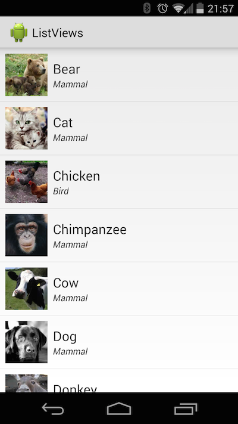
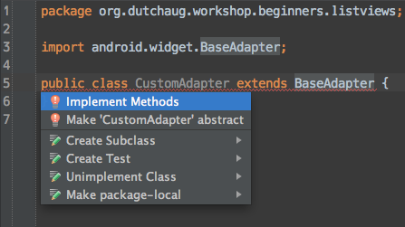
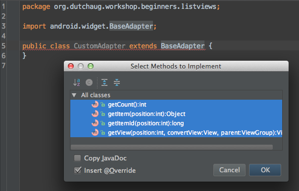

# _Lesson #4_<br/>ListViews and Adapters

## Learning goals
* Basic understanding of **ListViews** and **Adapters**,
* Workinging with the **ArrayAdapter**,
* Creating string array resources,
* Extending the **BaseAdapter** to create a custom adapter,
* Creating more complex layouts for the list items.

If you know all about the learning goals for this lesson move on to [lesson 5](../lesson5/README.md).

## Introduction
One of the most frequently used views in Android apps is the [**ListView**](http://developer.android.com/guide/topics/ui/layout/listview.html). It's also one of the more complex views and can become pretty cumbersome to work with if you don't play by the rules. Lists can be huge and its child views can be complex. If you don't _do it the right way_ your users might experience a bad performing scroll or other odd behaviour. We hope to give you a solid introduction to good use of this powerful view.

## Adding a ListView to your layout
A **ListView** usually displays a (large, if not huge) list of things which you can vertically scroll. The **ListView** only holds the amount of list item plus or minus a couple more in memory. Every time you scroll, the views that scroll out of view are _recycled_ and reused for the views that are scrolling into view. 

The _things_ in the list can have a custom view layout themselves. For the first example we'll simply use one of the standard layouts which you can find in the Android runtime library itself. It's the layout with id `android.R.layout.simple_list_item_1`. It's a very simple layout with just one **TextView** with id `@android:id/text1`

> Press `Cmd-Shift-O` on a Mac or `Ctrl-Shift-N` on a Windows/Linux machine to open the **go to file** prompt. Simply type `simple_list_item_1` in the search field. Click on one of the items you see to view this systems layout file's contents.

Okay, we've got a layout, now we need a _list of things_. You might retrieve your list from a server, or a database in real world Android applications, but it is good to know that for fixed lists you can easily create **string array resources** for every language or device specifically, just as any other Android resource.

```xml
<string-array name="animals">
    <item>bear</item>
    <item>cat</item>
    <item>chicken</item>
</string-array>
```

You can reference a string array resource from a [Context](../cheatsheet.md#context) using:

```java
getResources().getStringArray(R.array.animals)
```

## Adapters
An **Adapter** object acts as a _bridge_ or between an **AdapterView** (in our case the **ListView** which extends from AdapterView) and the underlying data for that view (our String array). The Adapter provides access to the data items. The Adapter is also responsible for making a **View** for each item in the data set by implementing a `public View getView (int position, View convertView, ViewGroup parent)` method, which our ListView conveniently calls whenever it needs to render the next view for item with position `position` in the list.

The [ArrayAdapter](http://developer.android.com/reference/android/widget/ArrayAdapter.html) is a very simple implementation of the **Adapter** interface, which allows us to bind data in an array to a layout XML file and a single **TextView** in that layout.

We've got all the necessary information to construct an **ArrayAdapter** in our example we use this constructor:

```java
public ArrayAdapter (Context context, int resource, T[] objects)
```

Parameters:

* **context** The current [context](../cheatsheet.md#context).
* **resource** The resource ID for a layout file containing a TextView to use when instantiating views.
* **objects** The objects to represent in the ListView.

## Exercises (part 1)

It's time to put the learned stuff into practice!

1. Import `lesson4` into Android Studio. 
1. Click on the “TODO” Tool View to see all `TODO` items in the project.

### Exercise 4.1: Create a list

1. From the “TODO” Tool View, double click on the `TODO Exercise 4.1` item. This opens the `ListViewInLayoutActivity.java` file at the spot where you should enter the code below. 

1. Set the content view to the `activity_listview_in_layout.xml` layout file. 

1. Bind a local `ListView` object to the `ListView` in the layout with a `findViewById` and the id you can find in the `activity_listview_in_layout.xml` layout file. 

1. Create a local variable `String[] entries` which contains the items in the `animals` string resource array (see [arrays.xml](listviews/src/main/res/values/arrays.xml)) 

1. Create a new **ArrayAdapter** instance with layout id `android.R.layout.simple_list_item_1` and assign this adapter to the **ListView** object. 

  At this time you should be able to see something on screen, so take your project for a spin here and click on the "ListView in layout" item.
  
1. **BONUS:** Create a custom list item layout, with at least one `TextView` with id `@android:id/text1`, and assign that to the `ArrayAdapter` constructor.

### Exercise 4.2: Listen for list item clicks

1. From the “TODO” Tool View, double click on the `TODO Exercise 4.2` item. 

1. Again create a local variable `String[] entries` which contains the items in the `animals` string resource array (see [arrays.xml](listviews/src/main/res/values/arrays.xml)) 

1. Create a new array adapter with layout id `android.R.layout.simple_list_item_1` and assign this adapter to the list view via the `getListView()` method. 

  At this time you should be able to see something on screen, so take your project for a spin here and click on the "ListView in layout" item.

1. **BONUS:** Override the `protected void onListItemClick(ListView l, View v, int position, long id)` method and try to display the animal name via a [Toast](../cheatsheet.md#toast) 

## Building a custom adapter with BaseAdapter
Okay, a list with Strings is kind of nice as an example, but what about a list with a little bit more information. Let's say a list of animals with a thumbnail image and two TextViews with the animal name and the type of animal. Something like this:



How do we go about creating that?

> You can read through the next steps or even better, toss away the existing `CustomAdapter.java` file and follow along and do all the steps yourself! 

Create a new class with name `CustomAdapter` which extends the **BaseAdapter** class. Android Studio will immediately show you something is wrong by red underlining the class definition. Hover your mouse over the red curly line to see what's wrong.


Move your cursor to the line in error an press `Alt-Enter` to see some quickfixes.



Select `Implement methods`, select all the suggested methods, click **OK** and watch the magic unfold.



* The `getCount` method should return the number of items in our adapter. 
* The `getItem` method should return the actual data object for a certain position. 
* The `getItemId` should return a unique id for our data item at the given position. 
* The `getView` method is the most important and most complex method to override. The `getView` method is responsible for binding a data item at the given position to a new or recycled view (the `convertView` argument).

If the `convertView` argument is `null` you have to use a so called [**LayoutInflater**](http://developer.android.com/reference/android/view/LayoutInflater.html) to convert the layout XML file to an actual **View** object. Here's how you do this in the `getView` method:

```java
if (convertView == null) {
  LayoutInflater layoutInflater = (LayoutInflater) mContext.getSystemService(Context.LAYOUT_INFLATER_SERVICE);
  convertView = layoutInflater.inflate(R.layout.custom_layout, null, false);
}
```

The `mContext` field is something you normally initialize in your custom adapter constructor. (Sometimes people initialize a **LayoutInflater** as a field in the constructor as well.)

```java
public CustomAdapter(Context context) {
  this.mContext = context;
}
```

You can use the `convertView` to find the image thumbnail and two text views.

```java
ImageView imageView = (ImageView) convertView.findViewById(R.id.thumbnail_image);
// Set the image resource of imageView to something you retrieve from your data

TextView textView = (TextView) convertView.findViewById(R.id.animal_name);
// Etc.
```

At the end of the `getView` method you should return the updated `convertView` which will be used as an item in the list view.

Okay, let's see this in action with some data.

## Exercises (part 2)

### Exercise 4.3: Implement the CustomAdapter

1. From the “TODO” Tool View, navigate to both items described as `TODO Exercise 4.3`. 
		
1. Complete the `getCount()`, `getItem(int position)` and `getItemId(int position)` methods to return logical values and take your project for a spin.
		
  For our purposes, we don't need a unique ID for each row, so you can return `0` as the item ID.		

1. In `CustomAdapterActivity` complete the `onListItemClick` method. Use the `position` to retrieve an `Animal` object from the `mCustomerAdapter` field and use the `animal.infoUrl` information to create a valid `Uri`.
   		   
  At this time you should be able to interact with list items, so take your project for a spin here and see if a browser opens up with your URL.

1. **BONUS:** Instead of using a **ListView** use a [**GridView**](http://developer.android.com/guide/topics/ui/layout/gridview.html) and the same custom adapter to create a grid of animal info.

## Conclusion
The **ListView** and extending the **BaseAdapter** are powerful tools to create great looking lists in your app. This lesson only showed you the tip of the iceberg. There are still many things to discover for a correct and optimal implementation of great performing lists. For example: 

* For more complex things, like showing multiple view types or animating items in as they appear, change and disappear from the list, you will certainly want to look at using [the RecyclerView](http://developer.android.com/training/material/lists-cards.html).
* It is highly advised to use the [ViewHolder pattern](http://developer.android.com/training/improving-layouts/smooth-scrolling.html#ViewHolder) for better performance (this is enforced when using RecyclerViews).
* At some point in time you might want to add [sections to your list view](http://cyrilmottier.com/2011/07/05/listview-tips-tricks-2-section-your-listview/).
* If you work with databases you will probably start extending the [**CursorAdapter**](http://developer.android.com/reference/android/widget/CursorAdapter.html) and you should definitely investigate the [**Loaders** pattern](http://developer.android.com/guide/components/loaders.html) for _asynchronously_ loading the data and automatically updating the list when items in the database change.

On to [lesson 5](../lesson5/README.md), where you will learn about **Fragments**, the **ViewPager** UI pattern and playing sounds with the **MediaPlayer**.
